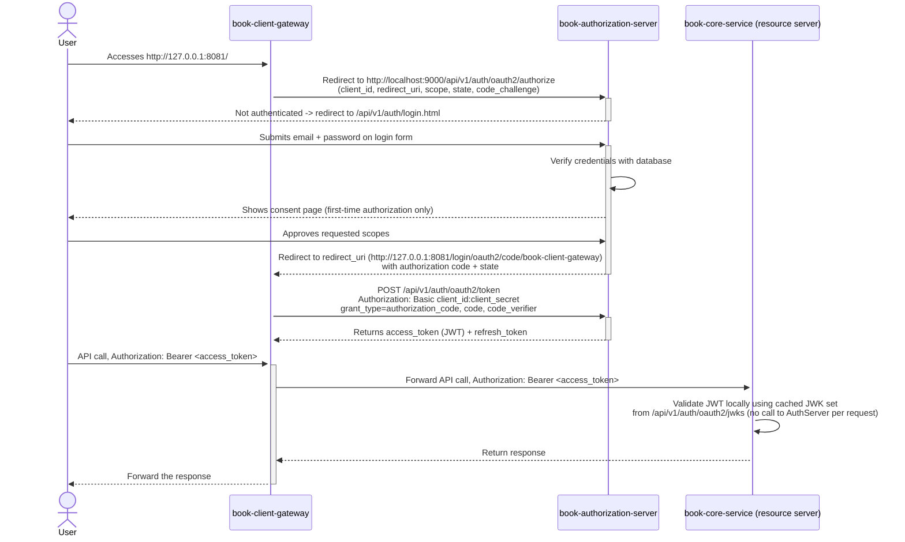

## Book App

The ultimate book app for surviving boring work hours. Shhh... we won't tell your boss! 🤫📚

# Tech Stack & Tools

### Core

| Category | Technology |
| --- | --- |
| Language | Java 21 |
| Framework | Spring Boot (4.0.x / 4.1.x), Spring Cloud (2025.1.x) |
| Build | Maven (per-service Spring Boot parent, repo-root Spotless aggregator) |
| Database | PostgreSQL 17 |
| DB Migration | Flyway |
| Persistence | Spring Data JPA / Hibernate |
| API Docs | springdoc-openapi (Swagger UI), OpenAPI Generator (`book-core-service`) |
| Mapping | MapStruct |
| Boilerplate | Lombok |
| Containerization | Docker Compose (local Postgres per service) |

### Security (OAuth2)

| Service | Role | Key Dependencies |
| --- | --- | --- |
| `book-authorization-server` | Authorization Server | Spring Authorization Server, Spring Security, Thymeleaf |
| `book-client-gateway` | OAuth2 Client / Gateway | Spring Cloud Gateway (WebFlux), OAuth2 Client, OAuth2 Resource Server (local JWT validation via JWK set) |
| `book-core-service` | Actual resource Server |  |

### book-core-service extras

| Category | Technology |
| --- | --- |
| Cloud Storage | Spring Cloud GCP (Google Cloud Storage) |
| Service-to-Service | Spring Cloud OpenFeign |
| File Processing | Apache Tika (content-type detection) |
| JSON | Jackson 3 |

### Developer Tooling

| Tool | Purpose |
| --- | --- |
| Spotless | Code formatting (Palantir Java Format), enforced repo-wide |
| Git hooks | Pre-commit `spotless:check` (`.githooks`) |
| CODEOWNERS | Review ownership |

# Project Folder Structure

```text
├───.githooks                           # Store git configuration
├───.idea                               # IDE configurations
├───.vscode                             # IDE configurations
├───docs
│   └───decisions                       # Architecture Decision Records (ADRs) - the "why" behind implementation choices
└───services
    ├───book-authorization-server       # Oauth2 Authorization server: responsible for managing users, authentication and authorization
    ├───book-client-gateway             # Oauth2 Client: acts as an gateway which is responsible for forwarding request to auth server or resource server if authenticated
    └───book-core-service               # Oauth2 Resource server: responsible for managing core data of the book application (i.e. book data, attachment data, read tracking progress...)
```

# Oauth2 Main Flow

Follow the pattern: Dumb Gateway, smart services.



## Design decisions:

See [`docs/decisions/`](docs/decisions/README.md) for the full, indexed set of
Architecture Decision Records (ADRs) — why each notable choice was made, what
alternatives were considered, and the trade-offs. Notably
[0002](docs/decisions/0002-session-strategy-gateway-vs-resource-server.md) covers
the stateful-gateway/stateless-resource-server session split summarized below.

# Local Setup

### book-client-gateway

```bash
mvn -f services/book-client-gateway/pom.xml spring-boot:run -Dspring-boot.run.profiles=local
```

### book-authorization-server

Start the local database

```bash
docker compose -f services/book-authorization-server/compose.yaml up -d
```

Start the application

```bash
mvn -f services/book-authorization-server/pom.xml spring-boot:run -Dspring-boot.run.profiles=local
```

### book-core-service

Start the local database

```bash
docker compose -f services/book-core-service/compose.yaml up -d
```

Start the application

```bash
mvn -f services/book-core-service/pom.xml spring-boot:run -Dspring-boot.run.profiles=local
```

# Code Formatting

Spotless is configured once at the repo root (`pom.xml`) and formats the Java code of every service.

Format all services:

```bash
mvn spotless:apply
```

Check formatting without modifying files (also run by the pre-commit hook):

```bash
mvn spotless:check
```